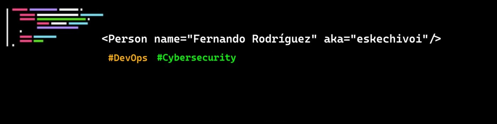

### Hi there 👋, my name is Fernando
### DevSecOps and Python Developer

I studied at University of Valladolid, in Spain. I did my internship and bachelor thesis at the Hochschule Kaiserslautern, Zweibrücken, Germany.

I am also member of `SUGUS UVa`, the Cybersecurity Team at University of Valladolid. I fully developed and deployed the association's website. You can visit the actual website, [sugusuva.es](https://sugusuva.es).

I am interested in `DevSecOps`.

:mag_right: Check out my GitHub profile for some cybersecurity challenges, with a focus on web pen testing, and some smaller projects!

Languages: Python / C++ / Bash / JavaScript (React, Express, NodeJS) /   

Technologies: Git / Docker / Jenkins / Kubernetes / LXC 

- 🔭 I’m currently working as a Python developer.
- 🌱 I’m currently learning about DevSecOps. 

## Experience

- Python Developer, Test Automation (with Robot Framework) and integration with Jenkins.
- Experience of testing in a microservices architecture built on Kubernetes.
- Manteinance and deployment of the SUGUS web page and SUGUS CTF infrastructure. ([sugusuva.es](https://sugusuva.es))
- Web Pentesting, certified by TCM Security Academy.

## Titles

- C1 Cambridge English certificate, level C2 (203/210).
- PWST _(Practical Web application Security and Testing)_, certified by TCM Security Academy.

    

