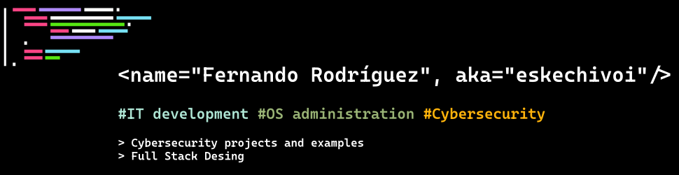

### Hi there 👋, my name is Fernando
### I am a  IT student at University of Valladolid

I study at University of Valladolid, in Spain, and i am interested in `Web Stack Security`, `managing IT systems` and `Web audit/pentesting`.

I am also member of `SUGUS UVa`, the Cybersecurity Team at University of Valladolid. I've designed the front-end of the page. You can see the [repo here](https://github.com/eskechivoi/Sugus_web), and also you can visit the actual website, [sugusuva.es](https://sugusuva.es).

:mag_right: In my GitHub profile, you will find fullstack websites, cryptographic software, and some little proyects!

Skills: HTML / JavaScript / CSS / Java / C++ / Python / Shell / PHP

Specific skills: LAMP Stack, Java J2EE, Bootstrap, jQuery

- 🔭 I’m currently working on fullstack website desing, java cryptographic environment and C++ libraries. 
- 🌱 I’m currently learning about developing software solutions for IT systems, OS administration and cybersecurity audit. 

## Experience

- Web Pentesting, certified by TCM Security Academy.
- Full Stack development using Java J2EE.
- Container management using docker.

## Titles

- B2.2 English certificate, certified by E.O.I Valladolid.
- PWST __(Practical Web application Security and Testing)__, certified by TCM Security Academy.

    

