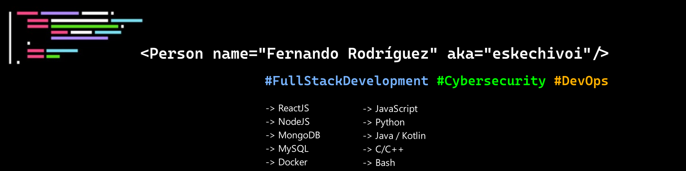

### Hi there 👋, my name is Fernando
### DevSecOps and Python Developer

I studied at University of Valladolid, in Spain. I did my internship and bachelor thesis at the Hochschule Kaiserslautern, Zweibrücken, Germany.

I am also member of `SUGUS UVa`, the Cybersecurity Team at University of Valladolid. I fully developed and deployed the association's website. You can visit the actual website, [sugusuva.es](https://sugusuva.es).

I am interested in `DevSecOps` and test automation.

:mag_right: In my GitHub profile, you will find cibersecurity challenges, centered on web pentesting, and some little proyects!

Skills: Python / C++ / Bash / JavaScript (React, Express, NodeJS) / Java / Kotlin /  

Technologies: Git / Docker / Jenkins /

- 🔭 I’m currently working as a Python developer.
- 🌱 I’m currently learning about DevSecOps. 

## Experience

- Python Developer & Test Engineer (with Robot Framework)
- Web Pentesting, certified by TCM Security Academy.
- Design, manteinance and deploy of the SUGUS web page. ([sugusuva.es](https://sugusuva.es))
- Full Stack development using Java J2EE.

## Titles

- B2.2 English certificate, certified by E.O.I Valladolid.
- PWST _(Practical Web application Security and Testing)_, certified by TCM Security Academy.

    

